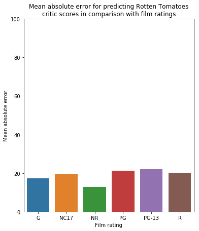

### Dicussion: Rotten Tomatoes Critic Score Predictor

#### Quick Overview

First we set up our environment with our various imports. Next, we read the CSV. I used the Kaggle dataset, and you can download it from there.

```python
CSV_PATH = "../input/rotten-tomatoes-movies-and-critics-datasets/rotten_tomatoes_movies.csv"
df = pd.read_csv(CSV_PATH)
```

We need to process our data before we can train it. Notice that films can have multiple genres. In this case, we need to split it up and encode them so that we can analyze it properly. For instance, suppose the genres for Frozen are "Animation, Kids & Family, Comedy". In this case, we need to split them and create individual genre columns [Animation_genre, Kids & Family_genre, Comedy_genre] and respectively one-hot encode them. Secondly, we need to label-encode the respective film ratings (such as PG, G, R, and so on).


```python
genre_cols = df.genre.str.get_dummies(sep=', ')
for col in genre_cols:
    df[col + '_genre'] = genre_cols[col].values

label_encoder = LabelEncoder()
df.rating = label_encoder.fit_transform(df.rating)

print("Columns provided: ")
print(df.columns)

print("Head (below): ")
df.head()
```

Next, we need to select the features and the prediction target. Before splitting the data, we one-hot encode the studio name. Split the data, and verify the shapes of the data frames to make sure everything has worked properly (the columns in the train and validation need to be the same size so that MAE is calculated appropriately).


```python
y = df['tomatometer_rating']
X = df[['rating', 'runtime_in_minutes', 'Action & Adventure_genre', 'Animation_genre', '...', 'Television_genre', 'Western_genre', 'studio_name']]

# Determine columns that are categorical in nature
obj = (X.dtypes == 'object')
object_cols = list(obj[obj].index)

# one-hot encode rating, directors, writers, studio_name 
OH_encoder = OneHotEncoder(handle_unknown = 'ignore', sparse = False)
OH_cols = pd.DataFrame(OH_encoder.fit_transform(X[object_cols]))
OH_cols.index = X.index
numerical_X = X.drop(object_cols, axis = 1)
OH_X = pd.concat([numerical_X, OH_cols], axis=1)

# Split our data
X_train, X_valid, y_train, y_valid = train_test_split(OH_X, y, random_state=0)

print("Verify that the columns are same size: ")
print(X_train.shape)
print(" vs ")
print(X_valid.shape)
```

In doing so, you might expect the following output:

    Verify that the columns are same size: 
    (5707, 1142)
     vs 
    (1903, 1142)

We create two methods that help us produce a Random Forest model and Gradient Boosting model respectively. For the gradient boosting, I used 350 estimators, a learning rate of 0.20, and 4 jobs (reduce this to 2 if you have a dual-core processor). For reduced error, increase the number of estimators and decrease the learning rate - note that this will also increase the training time.


```python
model = None;
predictions = None;

def train_and_validate(mln, DX_train, DX_valid, Dy_train, Dy_valid) :
    global model
    global predictions 
    
    model = RandomForestRegressor(max_leaf_nodes=mln, random_state = 1)
    model.fit(DX_train, Dy_train)
    
    predictions = model.predict(DX_valid)
    print(predictions)
    
    print(" ... vs ...")
    print(Dy_valid)
    
    mae = mean_absolute_error(Dy_valid, predictions)
    # print("MAE = " + str(mae))
    
    return mae

def xg_train_and_validate(DX_train, DX_valid, Dy_train, Dy_valid) :
    global model
    global predictions 
    
    model = XGBRegressor(n_estimators=350, learning_rate=0.20, n_jobs=4, random_state=1)
    model.fit(DX_train, Dy_train, early_stopping_rounds=5, 
              eval_set=[(DX_valid, Dy_valid)], verbose=False)
    
    predictions = model.predict(DX_valid)
    print(predictions)
    
    print(" ... vs ...")
    print(Dy_valid)
    
    mae = mean_absolute_error(Dy_valid, predictions)
    # print("MAE = " + str(mae))
    print("MAPE = " + str(mean_absolute_percentage_error(Dy_valid, predictions)))
    
    return mae
```

For the random forest model, we test different maximum leaf nodes that minimizes error. This reveals ~400 max leaf nodes for the random forest model provides MAE of ~19.


```python
for max_leaf_nodes in [4, 40, 400, 1600, 64000]:
    mae = train_and_validate(max_leaf_nodes, X_train, X_valid, y_train, y_valid)
    print("Max leaf nodes: %d  \t Mean Absolute Error:  %f" %(max_leaf_nodes, mae))
```

For the gradient boost model, we notice that we reach a lower MAE. We also notice that the data is not being overfit, since prediction with the training data itself produced MAE of about 17.

```python
# Predict with self.
print("MAE [self] = %d" %(xg_train_and_validate(X_train, X_train, y_train, y_train)) )

# Predict with validation data.
print("MAE [validation] = %d" %(xg_train_and_validate(X_train, X_valid, y_train, y_valid)) )
```

Our output was:


    MAE [self] = 17
    MAE [validation] = 19

#### Further analysis

We can further look at how the MAE corresponds with the genre of the film. There is a bunch of calculation code that you can look at yourself if you're interested, but let's jump to looking at the plot.

```python
plt.figure(figsize=(6,7))
plt.ylim(0, 100)
plt.title("Mean absolute error for predicting Rotten Tomatoes\ncritic scores in comparison with film ratings")
plt.ylabel("Mean absolute error")
plt.xlabel("Film rating")
s_plot = sns.barplot(x=np.array(['G', 'NC17', 'NR', 'PG', 'PG-13', 'R']), y=hist_X)
```




The MAE was lowest for NR (films with no rating) and was about 12, but highest for PG-13 (MAE about 22). Films that were NR might have had a lower budget or have a target audience outside the US, and so they did not submit the film to be rated by the MPAA. Fewer films are NR and fewer critics review these films, so the pool was drastically reduced.
