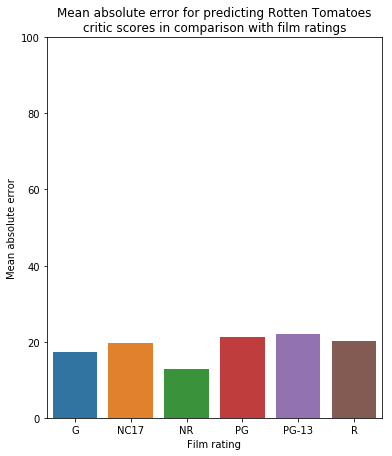

```python
# This Python 3 environment comes with many helpful analytics libraries installed
# It is defined by the kaggle/python docker image: https://github.com/kaggle/docker-python
# For example, here's several helpful packages to load in 

import numpy as np # linear algebra
import pandas as pd # data processing, CSV file I/O (e.g. pd.read_csv)
import matplotlib.pyplot as plt
import seaborn as sns

from sklearn.model_selection import train_test_split
from sklearn.preprocessing import OneHotEncoder
from sklearn.preprocessing import LabelEncoder
from sklearn.metrics import mean_absolute_error
from sklearn.tree import DecisionTreeRegressor
from sklearn.ensemble import RandomForestRegressor
from xgboost import XGBRegressor

# Input data files are available in the "../input/" directory.
# For example, running this (by clicking run or pressing Shift+Enter) will list all files under the input directory

import os
for dirname, _, filenames in os.walk('/kaggle/input'):
    for filename in filenames:
        print(os.path.join(dirname, filename))

# Any results you write to the current directory are saved as output.
```

    /kaggle/input/rotten-tomatoes-movies-and-critics-datasets/rotten_tomatoes_movies.csv
    /kaggle/input/rotten-tomatoes-movies-and-critics-datasets/rotten_tomatoes_reviews.csv


```python
CSV_PATH = "../input/rotten-tomatoes-movies-and-critics-datasets/rotten_tomatoes_movies.csv"
df = pd.read_csv(CSV_PATH)

print("Head (below): ")
df.head()
```

    Head (below): 


<div>
<style scoped>
    .dataframe tbody tr th:only-of-type {
        vertical-align: middle;
    }

    .dataframe tbody tr th {
        vertical-align: top;
    }

    .dataframe thead th {
        text-align: right;
    }
</style>
<table border="1" class="dataframe">
  <thead>
    <tr style="text-align: right;">
      <th></th>
      <th>rotten_tomatoes_link</th>
      <th>movie_title</th>
      <th>movie_info</th>
      <th>critics_consensus</th>
      <th>poster_image_url</th>
      <th>rating</th>
      <th>genre</th>
      <th>directors</th>
      <th>writers</th>
      <th>cast</th>
      <th>...</th>
      <th>studio_name</th>
      <th>tomatometer_status</th>
      <th>tomatometer_rating</th>
      <th>tomatometer_count</th>
      <th>audience_status</th>
      <th>audience_rating</th>
      <th>audience_count</th>
      <th>audience_top_critics_count</th>
      <th>audience_fresh_critics_count</th>
      <th>audience_rotten_critics_count</th>
    </tr>
  </thead>
  <tbody>
    <tr>
      <th>0</th>
      <td>/m/0814255</td>
      <td>Percy Jackson &amp; the Olympians: The Lightning T...</td>
      <td>A teenager discovers he's the descendant of a ...</td>
      <td>Though it may seem like just another Harry Pot...</td>
      <td>https://resizing.flixster.com/p1veUpQ4ktsSHtRu...</td>
      <td>PG</td>
      <td>Action &amp; Adventure, Comedy, Drama, Science Fic...</td>
      <td>Chris Columbus</td>
      <td>Craig Titley</td>
      <td>Logan Lerman, Brandon T. Jackson, Alexandra Da...</td>
      <td>...</td>
      <td>20th Century Fox</td>
      <td>Rotten</td>
      <td>49</td>
      <td>144</td>
      <td>Spilled</td>
      <td>53.0</td>
      <td>254287.0</td>
      <td>38</td>
      <td>71</td>
      <td>73</td>
    </tr>
    <tr>
      <th>1</th>
      <td>/m/0878835</td>
      <td>Please Give</td>
      <td>Kate has a lot on her mind. There's the ethics...</td>
      <td>Nicole Holofcener's newest might seem slight i...</td>
      <td>https://resizing.flixster.com/0AbudQ4KsB4BeXSB...</td>
      <td>R</td>
      <td>Comedy</td>
      <td>Nicole Holofcener</td>
      <td>Nicole Holofcener</td>
      <td>Catherine Keener, Amanda Peet, Oliver Platt, R...</td>
      <td>...</td>
      <td>Sony Pictures Classics</td>
      <td>Certified Fresh</td>
      <td>86</td>
      <td>140</td>
      <td>Upright</td>
      <td>64.0</td>
      <td>11567.0</td>
      <td>43</td>
      <td>121</td>
      <td>19</td>
    </tr>
    <tr>
      <th>2</th>
      <td>/m/10</td>
      <td>10</td>
      <td>Blake Edwards' 10 stars Dudley Moore as George...</td>
      <td>NaN</td>
      <td>https://resizing.flixster.com/mF0dxH6UTa0FdkMs...</td>
      <td>R</td>
      <td>Comedy, Romance</td>
      <td>Blake Edwards</td>
      <td>Blake Edwards</td>
      <td>Dudley Moore, Bo Derek, Julie Andrews, Robert ...</td>
      <td>...</td>
      <td>Waner Bros.</td>
      <td>Fresh</td>
      <td>68</td>
      <td>22</td>
      <td>Spilled</td>
      <td>53.0</td>
      <td>14670.0</td>
      <td>2</td>
      <td>15</td>
      <td>7</td>
    </tr>
    <tr>
      <th>3</th>
      <td>/m/1000013-12_angry_men</td>
      <td>12 Angry Men (Twelve Angry Men)</td>
      <td>A Puerto Rican youth is on trial for murder, a...</td>
      <td>Sidney Lumet's feature debut is a superbly wri...</td>
      <td>https://resizing.flixster.com/u-8xAyGaDVvROLiR...</td>
      <td>NR</td>
      <td>Classics, Drama</td>
      <td>Sidney Lumet</td>
      <td>Reginald Rose</td>
      <td>Martin Balsam, John Fiedler, Lee J. Cobb, E.G....</td>
      <td>...</td>
      <td>Criterion Collection</td>
      <td>Certified Fresh</td>
      <td>100</td>
      <td>51</td>
      <td>Upright</td>
      <td>97.0</td>
      <td>105000.0</td>
      <td>6</td>
      <td>51</td>
      <td>0</td>
    </tr>
    <tr>
      <th>4</th>
      <td>/m/1000079-20000_leagues_under_the_sea</td>
      <td>20,000 Leagues Under The Sea</td>
      <td>This 1954 Disney version of Jules Verne's 20,0...</td>
      <td>One of Disney's finest live-action adventures,...</td>
      <td>https://resizing.flixster.com/FKExgYBHu07XLoil...</td>
      <td>G</td>
      <td>Action &amp; Adventure, Drama, Kids &amp; Family</td>
      <td>Richard Fleischer</td>
      <td>Earl Felton</td>
      <td>James Mason, Kirk Douglas, Paul Lukas, Peter L...</td>
      <td>...</td>
      <td>Disney</td>
      <td>Fresh</td>
      <td>89</td>
      <td>27</td>
      <td>Upright</td>
      <td>74.0</td>
      <td>68860.0</td>
      <td>5</td>
      <td>24</td>
      <td>3</td>
    </tr>
  </tbody>
</table>
<p>5 rows × 23 columns</p>
</div>


```python
# A little pre-processing.
# Make genre comma-separated -> non. comma separated
print("Creating individual genre columns [Animation, Drama, Horror, ...] and saving to data frame")
genre_cols = df.genre.str.get_dummies(sep=', ')
# print(genre_cols)
for col in genre_cols:
    df[col + '_genre'] = genre_cols[col].values

# Make ratings label-encoded
print("Replacing ratings [PG, G, R, ... etc] with numbers 0 - ...")
unique = df['rating'].unique()
print(unique)
label_encoder = LabelEncoder()
df.rating = label_encoder.fit_transform(df.rating)
unique = df['rating'].unique()
print(unique)
# print(df.rating)

# Then drop the old genre/cast/direc/writers columns
# df.drop(['genre', 'cast', 'directors', 'writers'], axis=1)
    
print("Columns provided: ")
print(df.columns)

print("Head (below): ")
df.head()
```

    Creating individual genre columns [Animation, Drama, Horror, ...] and saving to data frame
    Replacing ratings [PG, G, R, ... etc] with numbers 0 - ...
    ['PG' 'R' 'NR' 'G' 'PG-13' 'PG-13)' 'NC17' 'R)']
    [3 6 2 0 4 5 1 7]
    Columns provided: 
    Index(['rotten_tomatoes_link', 'movie_title', 'movie_info',
           'critics_consensus', 'poster_image_url', 'rating', 'genre', 'directors',
           'writers', 'cast', 'in_theaters_date', 'on_streaming_date',
           'runtime_in_minutes', 'studio_name', 'tomatometer_status',
           'tomatometer_rating', 'tomatometer_count', 'audience_status',
           'audience_rating', 'audience_count', 'audience_top_critics_count',
           'audience_fresh_critics_count', 'audience_rotten_critics_count',
           'Action & Adventure_genre', 'Animation_genre', 'Anime & Manga_genre',
           'Art House & International_genre', 'Classics_genre', 'Comedy_genre',
           'Cult Movies_genre', 'Documentary_genre', 'Drama_genre',
           'Faith & Spirituality_genre', 'Gay & Lesbian_genre', 'Horror_genre',
           'Kids & Family_genre', 'Musical & Performing Arts_genre',
           'Mystery & Suspense_genre', 'Romance_genre',
           'Science Fiction & Fantasy_genre', 'Special Interest_genre',
           'Sports & Fitness_genre', 'Television_genre', 'Western_genre'],
          dtype='object')
    Head (below): 


<div>
<style scoped>
    .dataframe tbody tr th:only-of-type {
        vertical-align: middle;
    }

    .dataframe tbody tr th {
        vertical-align: top;
    }

    .dataframe thead th {
        text-align: right;
    }
</style>
<table border="1" class="dataframe">
  <thead>
    <tr style="text-align: right;">
      <th></th>
      <th>rotten_tomatoes_link</th>
      <th>movie_title</th>
      <th>movie_info</th>
      <th>critics_consensus</th>
      <th>poster_image_url</th>
      <th>rating</th>
      <th>genre</th>
      <th>directors</th>
      <th>writers</th>
      <th>cast</th>
      <th>...</th>
      <th>Horror_genre</th>
      <th>Kids &amp; Family_genre</th>
      <th>Musical &amp; Performing Arts_genre</th>
      <th>Mystery &amp; Suspense_genre</th>
      <th>Romance_genre</th>
      <th>Science Fiction &amp; Fantasy_genre</th>
      <th>Special Interest_genre</th>
      <th>Sports &amp; Fitness_genre</th>
      <th>Television_genre</th>
      <th>Western_genre</th>
    </tr>
  </thead>
  <tbody>
    <tr>
      <th>0</th>
      <td>/m/0814255</td>
      <td>Percy Jackson &amp; the Olympians: The Lightning T...</td>
      <td>A teenager discovers he's the descendant of a ...</td>
      <td>Though it may seem like just another Harry Pot...</td>
      <td>https://resizing.flixster.com/p1veUpQ4ktsSHtRu...</td>
      <td>3</td>
      <td>Action &amp; Adventure, Comedy, Drama, Science Fic...</td>
      <td>Chris Columbus</td>
      <td>Craig Titley</td>
      <td>Logan Lerman, Brandon T. Jackson, Alexandra Da...</td>
      <td>...</td>
      <td>0</td>
      <td>0</td>
      <td>0</td>
      <td>0</td>
      <td>0</td>
      <td>1</td>
      <td>0</td>
      <td>0</td>
      <td>0</td>
      <td>0</td>
    </tr>
    <tr>
      <th>1</th>
      <td>/m/0878835</td>
      <td>Please Give</td>
      <td>Kate has a lot on her mind. There's the ethics...</td>
      <td>Nicole Holofcener's newest might seem slight i...</td>
      <td>https://resizing.flixster.com/0AbudQ4KsB4BeXSB...</td>
      <td>6</td>
      <td>Comedy</td>
      <td>Nicole Holofcener</td>
      <td>Nicole Holofcener</td>
      <td>Catherine Keener, Amanda Peet, Oliver Platt, R...</td>
      <td>...</td>
      <td>0</td>
      <td>0</td>
      <td>0</td>
      <td>0</td>
      <td>0</td>
      <td>0</td>
      <td>0</td>
      <td>0</td>
      <td>0</td>
      <td>0</td>
    </tr>
    <tr>
      <th>2</th>
      <td>/m/10</td>
      <td>10</td>
      <td>Blake Edwards' 10 stars Dudley Moore as George...</td>
      <td>NaN</td>
      <td>https://resizing.flixster.com/mF0dxH6UTa0FdkMs...</td>
      <td>6</td>
      <td>Comedy, Romance</td>
      <td>Blake Edwards</td>
      <td>Blake Edwards</td>
      <td>Dudley Moore, Bo Derek, Julie Andrews, Robert ...</td>
      <td>...</td>
      <td>0</td>
      <td>0</td>
      <td>0</td>
      <td>0</td>
      <td>1</td>
      <td>0</td>
      <td>0</td>
      <td>0</td>
      <td>0</td>
      <td>0</td>
    </tr>
    <tr>
      <th>3</th>
      <td>/m/1000013-12_angry_men</td>
      <td>12 Angry Men (Twelve Angry Men)</td>
      <td>A Puerto Rican youth is on trial for murder, a...</td>
      <td>Sidney Lumet's feature debut is a superbly wri...</td>
      <td>https://resizing.flixster.com/u-8xAyGaDVvROLiR...</td>
      <td>2</td>
      <td>Classics, Drama</td>
      <td>Sidney Lumet</td>
      <td>Reginald Rose</td>
      <td>Martin Balsam, John Fiedler, Lee J. Cobb, E.G....</td>
      <td>...</td>
      <td>0</td>
      <td>0</td>
      <td>0</td>
      <td>0</td>
      <td>0</td>
      <td>0</td>
      <td>0</td>
      <td>0</td>
      <td>0</td>
      <td>0</td>
    </tr>
    <tr>
      <th>4</th>
      <td>/m/1000079-20000_leagues_under_the_sea</td>
      <td>20,000 Leagues Under The Sea</td>
      <td>This 1954 Disney version of Jules Verne's 20,0...</td>
      <td>One of Disney's finest live-action adventures,...</td>
      <td>https://resizing.flixster.com/FKExgYBHu07XLoil...</td>
      <td>0</td>
      <td>Action &amp; Adventure, Drama, Kids &amp; Family</td>
      <td>Richard Fleischer</td>
      <td>Earl Felton</td>
      <td>James Mason, Kirk Douglas, Paul Lukas, Peter L...</td>
      <td>...</td>
      <td>0</td>
      <td>1</td>
      <td>0</td>
      <td>0</td>
      <td>0</td>
      <td>0</td>
      <td>0</td>
      <td>0</td>
      <td>0</td>
      <td>0</td>
    </tr>
  </tbody>
</table>
<p>5 rows × 44 columns</p>
</div>


```python
df = df.dropna(axis=0)
# print(df) reveals no columns were dropped. Imputation not needed.
# unique = df['in_theaters_date'].unique()
# print(sorted(unique))

# y = df['tomatometer_status']

y = df['tomatometer_rating']
X = df[['rating', 'runtime_in_minutes', 'Action & Adventure_genre', 'Animation_genre', 'Anime & Manga_genre',
       'Art House & International_genre', 'Classics_genre', 'Comedy_genre',
       'Cult Movies_genre', 'Documentary_genre', 'Drama_genre',
       'Faith & Spirituality_genre', 'Gay & Lesbian_genre', 'Horror_genre',
       'Kids & Family_genre', 'Musical & Performing Arts_genre',
       'Mystery & Suspense_genre', 'Romance_genre',
       'Science Fiction & Fantasy_genre', 'Special Interest_genre',
       'Sports & Fitness_genre', 'Television_genre', 'Western_genre', 'studio_name']]

# Split our data
# X_train, X_valid, y_train, y_valid = train_test_split(X, y, random_state=0)

# print(X_train.shape)
# print(" vs ")
# print(X_valid.shape)

# Determine columns that are categorical in nature
obj = (X.dtypes == 'object')
object_cols = list(obj[obj].index)
print("Categorical: ")
print(object_cols)

# one-hot encode rating, directors, writers, studio_name 
OH_encoder = OneHotEncoder(handle_unknown = 'ignore', sparse = False)
OH_cols = pd.DataFrame(OH_encoder.fit_transform(X[object_cols]))

OH_cols.index = X.index

numerical_X = X.drop(object_cols, axis = 1)

OH_X = pd.concat([numerical_X, OH_cols], axis=1)

print("Complete shape of feature dataframe: ")
print(OH_X.shape)
#y_train.head()
# y_valid.head()

# Split our data
X_train, X_valid, y_train, y_valid = train_test_split(OH_X, y, random_state=0)

print("Verify that the columns are same size: ")
print(X_train.shape)
print(" vs ")
print(X_valid.shape)
```

    Categorical: 
    ['studio_name']
    Complete shape of feature dataframe: 
    (7610, 1142)
    Verify that the columns are same size: 
    (5707, 1142)
     vs 
    (1903, 1142)


```python
def mean_absolute_percentage_error(y_valid, y_prediction): 
    y_valid = np.array(y_valid)
    y_prediction = np.array(y_prediction)
    return np.mean(np.abs((y_valid - y_prediction) / y_valid)) * 100
```


```python
model = None;
predictions = None;

def train_and_validate(DX_train, DX_valid, Dy_train, Dy_valid) :
    global model
    global predictions 
    
    model = RandomForestRegressor(random_state = 1)
    model.fit(DX_train, Dy_train)
    
    predictions = model.predict(DX_valid)
    print(predictions)
    
    mae = mean_absolute_error(Dy_valid, predictions)
    # print("MAE = " + str(mae))
    
    return mae

def train_and_validate(mln, DX_train, DX_valid, Dy_train, Dy_valid) :
    global model
    global predictions 
    
    model = RandomForestRegressor(max_leaf_nodes=mln, random_state = 1)
    model.fit(DX_train, Dy_train)
    
    predictions = model.predict(DX_valid)
    print(predictions)
    
    print(" ... vs ...")
    print(Dy_valid)
    
    mae = mean_absolute_error(Dy_valid, predictions)
    # print("MAE = " + str(mae))
    
    return mae

def xg_train_and_validate(DX_train, DX_valid, Dy_train, Dy_valid) :
    global model
    global predictions 
    
    model = XGBRegressor(n_estimators=350, learning_rate=0.20, n_jobs=4, random_state=1)
    model.fit(DX_train, Dy_train, early_stopping_rounds=5, 
              eval_set=[(DX_valid, Dy_valid)], verbose=False)
    
    predictions = model.predict(DX_valid)
    print(predictions)
    
    print(" ... vs ...")
    print(Dy_valid)
    
    mae = mean_absolute_error(Dy_valid, predictions)
    # print("MAE = " + str(mae))
    print("MAPE = " + str(mean_absolute_percentage_error(Dy_valid, predictions)))
    
    return mae
```


```python
# This reveals ~400 max leaf nodes for the RandomForest model provides MAE of ~19:

for max_leaf_nodes in [4, 40, 400, 1600, 64000]:
    mae = train_and_validate(max_leaf_nodes, X_train, X_valid, y_train, y_valid)
    print("Max leaf nodes: %d  \t Mean Absolute Error:  %f" %(max_leaf_nodes, mae))
```

    /opt/conda/lib/python3.6/site-packages/sklearn/ensemble/forest.py:245: FutureWarning: The default value of n_estimators will change from 10 in version 0.20 to 100 in 0.22.
      "10 in version 0.20 to 100 in 0.22.", FutureWarning)


    [64.52868826 64.52868826 78.98846281 ... 58.99984296 70.61802545
     50.95556085]
     ... vs ...
    737      98
    10978    97
    1247     27
    14372    15
    1713     85
             ..
    1893     64
    4257     88
    4744     71
    2514     83
    7903     86
    Name: tomatometer_rating, Length: 1903, dtype: int64
    Max leaf nodes: 4  	 Mean Absolute Error:  22.046799


    /opt/conda/lib/python3.6/site-packages/sklearn/ensemble/forest.py:245: FutureWarning: The default value of n_estimators will change from 10 in version 0.20 to 100 in 0.22.
      "10 in version 0.20 to 100 in 0.22.", FutureWarning)


    [76.36872017 73.49129561 77.91784425 ... 54.99161026 72.39179964
     50.57281136]
     ... vs ...
    737      98
    10978    97
    1247     27
    14372    15
    1713     85
             ..
    1893     64
    4257     88
    4744     71
    2514     83
    7903     86
    Name: tomatometer_rating, Length: 1903, dtype: int64
    Max leaf nodes: 40  	 Mean Absolute Error:  20.192440


    /opt/conda/lib/python3.6/site-packages/sklearn/ensemble/forest.py:245: FutureWarning: The default value of n_estimators will change from 10 in version 0.20 to 100 in 0.22.
      "10 in version 0.20 to 100 in 0.22.", FutureWarning)


    [81.51816023 75.40866702 79.23194039 ... 58.12724402 61.92464059
     56.26822054]
     ... vs ...
    737      98
    10978    97
    1247     27
    14372    15
    1713     85
             ..
    1893     64
    4257     88
    4744     71
    2514     83
    7903     86
    Name: tomatometer_rating, Length: 1903, dtype: int64
    Max leaf nodes: 400  	 Mean Absolute Error:  19.815716


    /opt/conda/lib/python3.6/site-packages/sklearn/ensemble/forest.py:245: FutureWarning: The default value of n_estimators will change from 10 in version 0.20 to 100 in 0.22.
      "10 in version 0.20 to 100 in 0.22.", FutureWarning)


    [78.65864504 70.35       84.28519184 ... 61.57016484 65.12055528
     63.19096408]
     ... vs ...
    737      98
    10978    97
    1247     27
    14372    15
    1713     85
             ..
    1893     64
    4257     88
    4744     71
    2514     83
    7903     86
    Name: tomatometer_rating, Length: 1903, dtype: int64
    Max leaf nodes: 1600  	 Mean Absolute Error:  20.264396


    /opt/conda/lib/python3.6/site-packages/sklearn/ensemble/forest.py:245: FutureWarning: The default value of n_estimators will change from 10 in version 0.20 to 100 in 0.22.
      "10 in version 0.20 to 100 in 0.22.", FutureWarning)


    [79.9 71.  83.8 ... 60.8 58.3 63.5]
     ... vs ...
    737      98
    10978    97
    1247     27
    14372    15
    1713     85
             ..
    1893     64
    4257     88
    4744     71
    2514     83
    7903     86
    Name: tomatometer_rating, Length: 1903, dtype: int64
    Max leaf nodes: 64000  	 Mean Absolute Error:  20.490648


```python
# Predict with self.
print("MAE [self] = %d" %(xg_train_and_validate(X_train, X_train, y_train, y_train)) )

# Predict with validation data.
print("MAE [validation] = %d" %(xg_train_and_validate(X_train, X_valid, y_train, y_valid)) )
```

    /opt/conda/lib/python3.6/site-packages/xgboost/core.py:587: FutureWarning: Series.base is deprecated and will be removed in a future version
      if getattr(data, 'base', None) is not None and \


    [22:28:57] WARNING: /workspace/src/objective/regression_obj.cu:152: reg:linear is now deprecated in favor of reg:squarederror.
    [78.066345 69.377525 69.61798  ... 45.044754 69.29976  69.908394]
     ... vs ...
    9194     86
    11571    96
    10737    81
    15333    46
    11402    87
             ..
    10904    77
    7199     87
    3668     21
    5756     56
    6030     70
    Name: tomatometer_rating, Length: 5707, dtype: int64
    MAPE = inf
    MAE [self] = 17


    /opt/conda/lib/python3.6/site-packages/ipykernel_launcher.py:4: RuntimeWarning: divide by zero encountered in true_divide
      after removing the cwd from sys.path.
    /opt/conda/lib/python3.6/site-packages/xgboost/core.py:587: FutureWarning: Series.base is deprecated and will be removed in a future version
      if getattr(data, 'base', None) is not None and \


    [22:29:21] WARNING: /workspace/src/objective/regression_obj.cu:152: reg:linear is now deprecated in favor of reg:squarederror.
    [85.79117 76.08711 65.46227 ... 58.87415 67.76201 64.99933]
     ... vs ...
    737      98
    10978    97
    1247     27
    14372    15
    1713     85
             ..
    1893     64
    4257     88
    4744     71
    2514     83
    7903     86
    Name: tomatometer_rating, Length: 1903, dtype: int64
    MAPE = inf
    MAE [validation] = 19


    /opt/conda/lib/python3.6/site-packages/ipykernel_launcher.py:4: RuntimeWarning: divide by zero encountered in true_divide
      after removing the cwd from sys.path.


```python
print(predictions) # compare with y_valid
valid = y_valid.to_numpy() #indices, as you see above, are not neat (y_valid[737], y_valid[10978], ...). convert it to numpy array.    # .index.values
corresponding_rating = X_valid.rating.to_numpy() # removes indices.

print(predictions.shape)
print(valid.shape)

print(corresponding_rating)

hist_X = np.zeros(6) # => keep sum [G, NC17, NR, PG, PG-13 and PG-13), R and R)]
count_X = np.zeros(6) # => keep count

err = np.zeros( (predictions.shape[0]) )

for i in range(predictions.shape[0]):
    err[i] = abs(predictions[i] - valid[i])
    # print("This: " + str(corresponding_rating[i]) + " with error " + str(err[i]))
    if(corresponding_rating[i] == 0): #G
        hist_X[0] = (err[i] + hist_X[0])
        count_X[0] += 1
    elif (corresponding_rating[i] == 1): #NC-17
        hist_X[1] = (err[i] + hist_X[1])
        count_X[1] += 1
    elif (corresponding_rating[i] == 2): #NR
        hist_X[2] = (err[i] + hist_X[2])
        count_X[2] += 1
    elif (corresponding_rating[i] == 3): #PG
        hist_X[3] = (err[i] + hist_X[3])
        count_X[3] += 1
    elif (corresponding_rating[i] == 4 or corresponding_rating[i] == 5): #PG-13 || PG-13)
        hist_X[4] = (err[i] + hist_X[4])
        count_X[4] += 1
    elif (corresponding_rating[i] == 6 or corresponding_rating[i] == 7): #R || R)
        hist_X[5] = (err[i] + hist_X[5])
        count_X[5] += 1
        
        
for j in range(6):
    hist_X[j] = (hist_X[j] / float(count_X[j]))

print ("\nMean error compared with admission ratings...\n\t[G, NC17, NR, PG, PG-13, R] <=> " + str(hist_X))
```

    [85.79117 76.08711 65.46227 ... 58.87415 67.76201 64.99933]
    (1903,)
    (1903,)
    [3 6 0 ... 6 4 6]
    
    Mean error compared with admission ratings...
    	[G, NC17, NR, PG, PG-13, R] <=> [17.17956752 19.56365395 12.724407   21.31040411 21.89151695 20.20572742]


```python
plt.figure(figsize=(6,7))
plt.ylim(0, 100)
plt.title("Mean absolute error for predicting Rotten Tomatoes\ncritic scores in comparison with film ratings")
plt.ylabel("Mean absolute error")
plt.xlabel("Film rating")
s_plot = sns.barplot(x=np.array(['G', 'NC17', 'NR', 'PG', 'PG-13', 'R']), y=hist_X)

```




